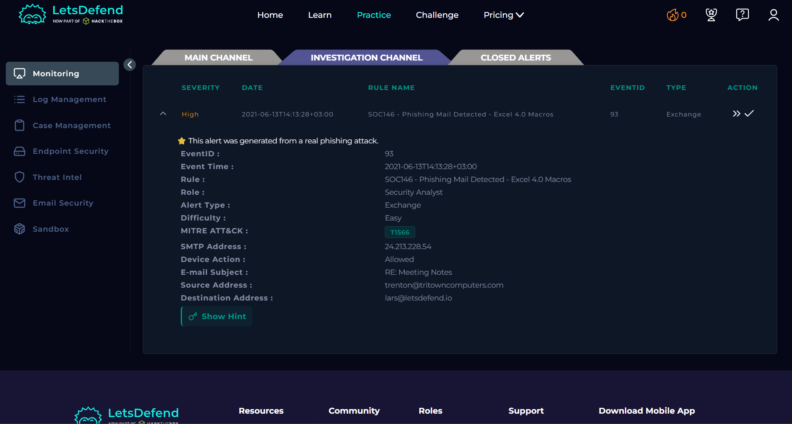
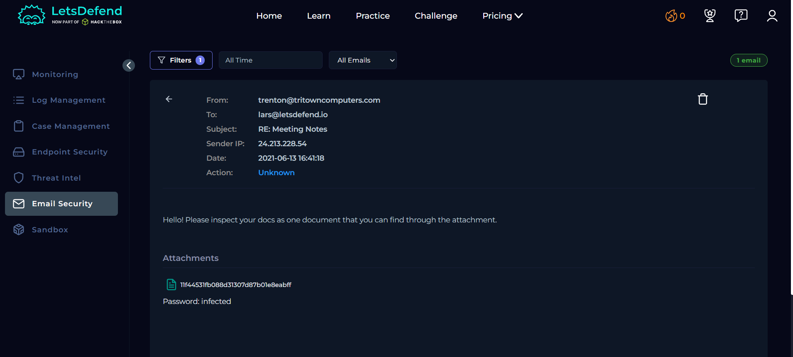
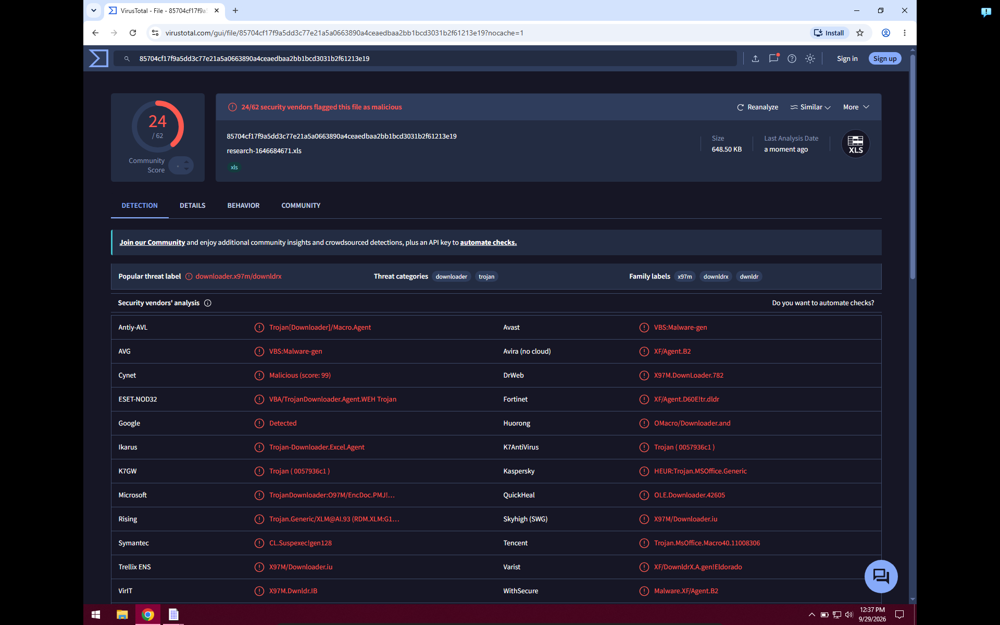
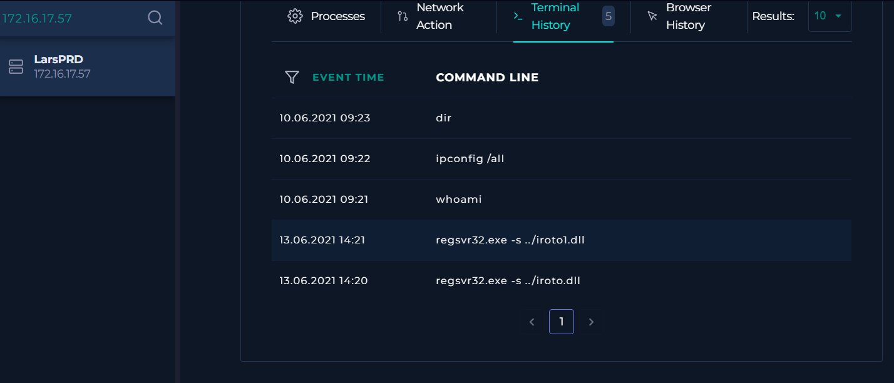
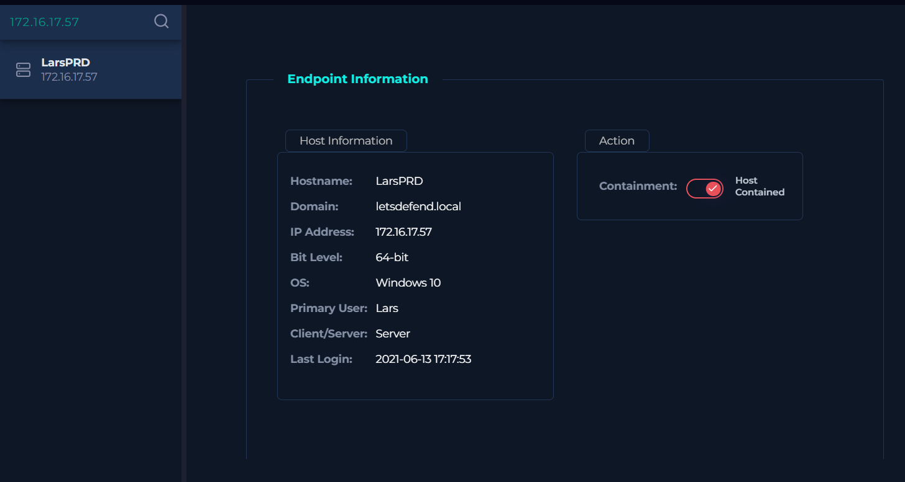
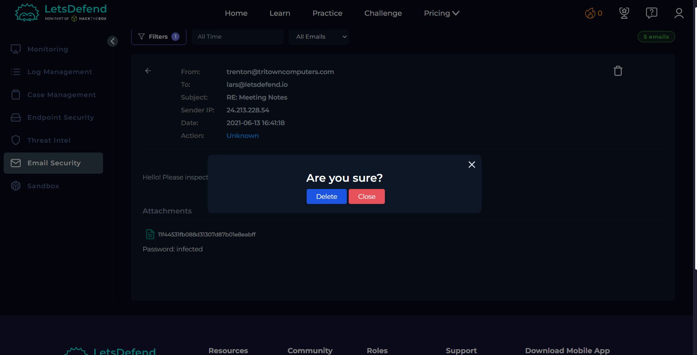

## SOC146: Phishing Mail Detected - Excel 4.0 Macros

**Event ID:** 93 | **Severity:** High | **Type:** Exchange | **Verdict:** True Positive

### What happened

A phishing alert was raised for an email with the subject **"RE: Meeting Notes"**. It came from `trenton@tritowncomputers.com` and was sent to `lars@letsdefend.io`. LetsDefend's own note says this alert was generated from a real phishing attack, so it's a good one to write up. The security tool's action was **"Allowed"**, meaning the email reached the inbox and was not blocked.

The alert type points to **Excel 4.0 Macros**, an old Excel feature that attackers still use to run hidden commands when someone opens an infected spreadsheet attachment.

The email itself is short: *"Hello! Please inspect your docs as one document that you can find through the attachment."* This kind of generic, urgency-free wording with no personal detail is a common phishing pattern. The attachment is also **password protected** (password: `infected`), which is a classic trick attackers use so antivirus scanners can't open and scan the file automatically.

### Key details

|Item|Value|
|-|-|
|Event ID|93|
|Event time|2021-06-13 14:13:28|
|Sender IP|24.213.228.54|
|Email date|2021-06-13 16:41:18|
|Email subject|RE: Meeting Notes|
|Sender (source)|trenton@tritowncomputers.com|
|Recipient (destination)|lars@letsdefend.io|
|Device action|Allowed / Unknown|
|Attachment|11f44531fb088d31307d87b01e8eabff|
|Attachment password|infected|

### What I did, step by step

**1. Read the alert.** Noted the sender, recipient, subject, and SMTP address.

**2. Checked the sender's IP.** I searched the sender's IP in Email Security in the LetsDefend SIEM and found an attachment file with the password `infected`.

**3. Checked the host activity.** After checking the host `lars@letsdefend.io` (LarsPRD, `172.16.17.57`), I saw the host connect to an external suspicious IP (`192.232.219.67`) shortly after the mail was received. The process list also shows `regsvr32.exe` running on the host.

**4. Executed the file in a sandbox.** I ran the file (from IP `24.213.228.54`) in an isolated malware analysis lab. After executing `research-1646684671.xls`, it dropped two DLL files named `iroto.dll` and `iroto1.dll`. I hashed all three files with HashMyFiles and checked them in VirusTotal. All three came back malicious: the XLS was flagged by 24/62 vendors, `iroto.dll` by 28/71 and `iroto1.dll` by 14/50.

**5. Confirmed execution, contained the host and deleted the mail.** Terminal history on the host shows `regsvr32.exe -s ../iroto.dll` and `regsvr32.exe -s ../iroto1.dll` were run on 13.06.2021, which confirms the host executed the file. I then contained the host machine to stop further spread of the malware and deleted the phishing email.

**6. Closed the alert** as **True Positive** and wrote my notes.

### Indicators of Compromise

|Type|Value|
|-|-|
|Sender address|trenton@tritowncomputers.com|
|Sender IP|24.213.228.54|
|Contacted external IP|192.232.219.67|
|Subject line|RE: Meeting Notes|
|Attachment name/hash|`research-1646684671.xls` / `11f44531fb088d31307d87b01e8eabff`|
|Dropped files|iroto.dll, iroto1.dll|
|Attachment password|infected|

### MITRE ATT&CK

|Tactic|Technique|What I saw|
|-|-|-|
|Initial Access|T1566 Phishing (as tagged by LetsDefend)|Email delivered to lars@letsdefend.io|
|Execution|T1204.002 User Execution: Malicious File|`research-1646684671.xls`|
|Execution|T1059 Command and Scripting Interpreter (Excel 4.0 macro)|`regsvr32.exe` command|

### Why it's a True Positive

* LetsDefend's own note confirms this came from a real phishing attack.
* The attachment was password protected to evade scanning.
* Executing it in a sandbox dropped two DLLs that VirusTotal flagged as malicious.
* The host connected to a suspicious external IP shortly after the email arrived.

### How to respond

* Remove the email from the mailbox if not already done.
* Block the sender domain and SMTP IP.
* If the attachment was opened, isolate that host and scan for further spread.
* Warn the user (lars) about the phishing email.

### What I learned

* Macro-based attachments are still a common way to deliver malware through "trusted-looking" emails.
* [Add anything specific you noticed, e.g. mail filtering gaps, lack of macro blocking policy.]

---

**Tools used:** LetsDefend Email Security, Log Management, Endpoint Security, MITRE ATT&CK, VirusTotal

